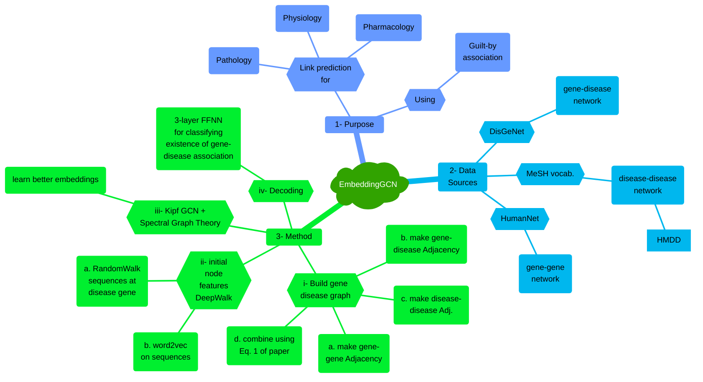
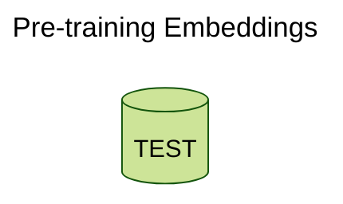

# Paper Review: EmbeddingGCN

## Table of Contents
1. [Jargon Glossary](#jargon-glossary)
2. [Problem Description](#problem-description)
3. [Problem Relevance](#problem-relevance)
4. [Proposed Solution](#proposed-solution)
5. [Positive Points](#positive-points)
6. [Negative Points](#negative-points)
7. [Questions](#questions)
8. [References](#references)

## Jargon Glossary
[_back to contents_](#table-of-contents)

>**HMDD** - human miRNA-associated disease database

## Problem Description
[_back to contents_](#table-of-contents)

TODO

## Problem Relevance
[_back to contents_](#table-of-contents)

TODO

## Proposed Solution
[_back to contents_](#table-of-contents)

TODO

### Experimental Data
TODO

### Pre-training Embeddings

## Positive Points
[_back to contents_](#table-of-contents)

TODO

## Negative Points
[_back to contents_](#table-of-contents)

TODO

## Questions
[_back to contents_](#table-of-contents)

TODO

## References
[_back to contents_](#table-of-contents)

[Lvxing Zhu, Zhaolin Hong, Haoran Zheng, "Predicting gene-disease associations via graph embedding and graph convolutional networks," in _2019 IEEE International Conference on Bioinformatics and Biomedicine (BIBM)_, pp. 382–389, 2019.](https://ieeexplore.ieee.org/document/8983350)
