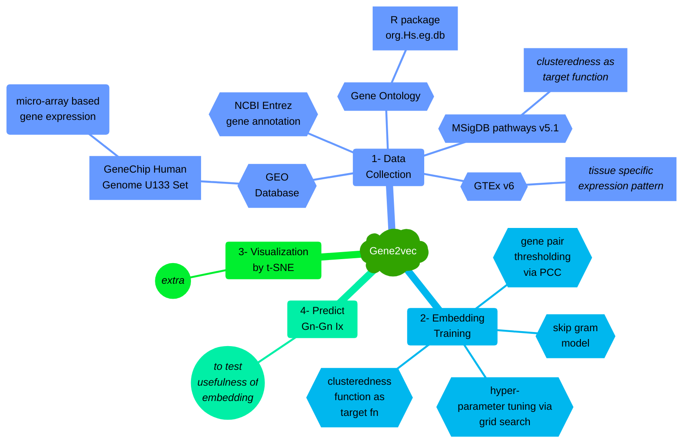
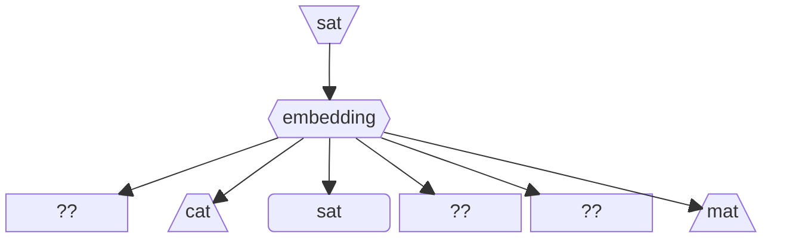
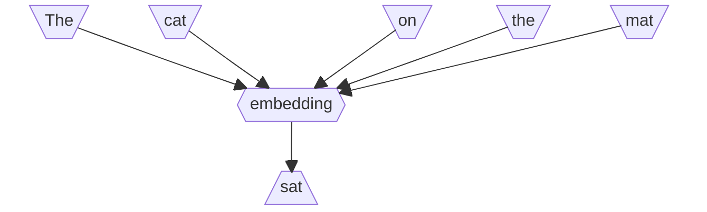

<script type="text/javascript" src="MathJax.js"></script>

<script type="text/x-mathjax-config">
MathJax.Hub.Config({
    tex2jax: {
        inlineMath: [['$','$'], ['\\(','\\)']],
        skipTags: ['script', 'noscript', 'style', 'textarea', 'pre'] // removed 'code' entry
    }
});
MathJax.Hub.Queue(function() {
    var all = MathJax.Hub.getAllJax(), i;
    for(i = 0; i < all.length; i += 1) {
        all[i].SourceElement().parentNode.className += ' has-jax';
    }
});
</script>


# Paper Review: Gene2vec

## Table of Contents
1. [Jargon Glossary](#jargon-glossary)
2. [Problem Description](#problem-description)
3. [Problem Relevance](#problem-relevance)
4. [Proposed Solution](#proposed-solution)
5. [Positive Points](#positive-points)
6. [Negative Points](#negative-points)
7. [Questions](#questions)
8. [References](#references)

## Jargon Glossary
[_back to contents_](#table-of-contents)

>**functional annotation/description** - description of a function of the protein that a gene produces

>**gene** - molecular gene is a sequence of nucleotides in DNA

>**gene-expression** - using information from a gene to synthesize either proteins or non-coding RNA

>**gene co-expression** - when expression of two or more genes are correlated

>**genome** - umbrella term, includes _all_ genetic information of an organism

>**pathways** - when different genes work in different sequential steps of a biological process, it is called a _genetic pathway_

>**transcript** - A primary transcript is the single-stranded ribonucleic acid (RNA) product synthesized by transcription of DNA, and processed to yield various mature RNA products such as mRNAs, tRNAs, and rRNAs

>**transcription** - Both DNA and RNA are nucleic acids, which use base pairs of nucleotides as a complementary language. During transcription, a DNA sequence is read by an RNA polymerase, which produces a complementary, antiparallel RNA strand called a primary transcript

>**transcriptome** - _set_ of all transcripts (including coding and non-coding)

## Problem Description
[_back to contents_](#table-of-contents)

This paper attempts to figure out, how to represent all human **gene**s as $n$-dimensional vectors, such that they also capture functional relatedness of the genes. These vectors are to be the _distributed_ representation of the genes, in line with word embeddings (as in Natural Language Processing).

## Problem Relevance
[_back to contents_](#table-of-contents)

A naive way to think of a **gene** is that, it is made up of multiple **transcript**s; where as all transcripts in the human **genome** have been identified, the **functional annotation**s of the gene is _discrete_, _categorical_ and through _manual efforts_.

In NLP, a word's vector representation (neural embedding) depends on the co-occurrence of other words in the same sentence. Leveraging this idea, the authors have used **gene co-expression** as the basis of similarity for obtaining the _**gene embeddings**_. 

Such gene embeddings may be used for multiple downstream tasks such as _finding gene-gene interactions_, clustering the embeddings in some dimensional space to _group genes into some functional group_, etc.

## Proposed Solution
[_back to contents_](#table-of-contents)

The proposed experimental setup mostly depends on the data collection and processing for a relatively straightforward neural network. The main components for the entire solution may be summarized in the _mindmap_ that follows:


The flow of the logic for each of the major components (viz., _Data Collection_, _Embedding Training_, _Visualization_ & _Downstream Task_) is described next:

### Data Collection
The data sources are:
1. **GEO database**'s **GeneChip Human Genome U133 Plus 2.0 Array set**,  which provides gene-expression information via the older micro-array based method. Probe sets with $\ge30$ samples and large intra-sample variance were chosen. The gene-coexpression was measured using the _Pearson Correlation Coefficient_. The gene pairs with $\mathcal{PCC} \ge0.9$ were used for training
2. Gene-gene interaction information is obtained from **Gene Ontology** annotations accessed via the `R` package `org.Hs.eg.db`. Gene pairs that share annotation (_GO category "Biological Process"_) form the _positive set_ and those that don't, form the _negative set_. The genes were also mapped to the **NCBI Entrez Gene** knowledge base.
3. **GTEx v6** data was used to compute tissue specificity (_z-score_) by comparing avg. gene expression of all genes across 27 tissues. Apparently, this value is mapped to the gene-expression info in (1) above
4. With pathways information from **KEGG**, **Biocarta**, and **Reactome**, _clusteredness_ from **MSigDB pathways v5.1** is used to setup the _Loss Function_ for the optimization of the learnable parameters.

### Embedding Training
In general, a neural embedding aims at mapping items in a discrete space into a continuous _Euclidean_ space. Embeddings enable the computation of _gradients_ and thus training of a neural network.

Their are two NLP methods, viz., _skip-gram model_ and _continuous-bag-of-words_. Each can be quickly visualized using the following diagrams:

First let us look at **_skip-gram model_**: the target word is the input (_here, it is "sat"_) and the model has to predict the most context sensitive words (excluding stop words) (_here the words, "cat" and "mat"_). For this, the probabilities are predicted over entire vocabulary.



In the **_continuous-bag-of-words model_**: the context is the input, where the words preceding and following a target word are input, and a probability for the target word is predicted. In essence, it is just the reverse of _skip-gram_.

The **authors have used the _skip-gram model_ to model the learning**. The idea involves creating an ordered vocabulary of all unique genes, and represent each gene by a one-hot vector. These vectors are input to the neural network. The network calculates loss and thus gradients based on whether or not the correct probability of coexpression was predicted by the network. Further, a grid search is performed for hyper-parameters such as **_number of iterations_** and **_dimensions of embeddings_**.

Once the parameters and hyper-parameters reach apparent convergence, the vector generated by the last hidden layer forms the gene embedding. The entire process may be understood as follows:
```mermaid
%%{init: {
    'theme':'forest',
    'mermaidMaxSourceCharacters': 5000
}}%%
---
title: Training
---
flowchart
    subgraph dbpk1["Gene co-expression"]
        direction TB
        db1[(GEO U133)]
        db2[(NCBI Entrez)]
        db3[(R pkg for GO)]
        db4[(GTEx v6)]
    end
    subgraph dbpk2["Pathways"]
        direction TB
        db5[(KEGG)]
        db6[(BioCarta)]
        db7[(Reactome)]
        db8[(MSigDB v5.1)]
    end
    p1{{Prepare gene<br/>coexpression +ve/-ve<br/>pairs}}
    p2[create ordered<br/>vocabulary for all<br/>unique genes]
    
    subgraph "Grid Search"
        gs1{{init hyper-param grid}}
        gs2[/pick next grid tuple/]
        subgraph logic ["Training Logic"]
            direction TB
            l1[/one-hot vector<br/>for genes/]
            l2[for each gene]
            l3[[generate embedding]]
            l4[predict co-expression<br/>softmax-probability for<br/>all other genes]
            l5[compute cross-entropy<br/>loss for gene pairs]
        end
        gs3[compute clusteredness]
    end

    dbpk1 --> p1
    dbpk2 --> p1
    p1 --> p2
    gs1 --> gs2
    gs2 -.-> logic
    p2 --> l1
    l1 --> l2
    l2 --> l3
    l3 --> l4
    l4 --> l5
    l5 -->|continue backprop till convergence| l2
    logic -.-> gs3
    gs3 --> gs2
```

The cross-entropy loss attempts to minimize the following (_as per the paper_):
$$
    -\sum_{(g_i, g_j)\in \mathit{T}} \mathit{Pr}(g_i | g_j)
$$
where,

$\mathit{T:}$ set of highly co-expressed gene pairs

$
\mathit{Pr}(g_i | g_j) =
    \frac{
        \mathit{exp(v_i^T v_j)}
    }{
        \sum_{j'} \mathit{exp(v_i^T v_{j'})}
    }
$

In other words, the cross-entropy loss will maximize the likelihood of highly co-expressed genes and reduce the likelihood of unrelated ones.

>This is my understanding. Seems the paper has some discrepancy in the formula though!

For the grid search that is used to find the most useful values for the hyper-parameter, the following clusteredness formula is used:

$$
    \mathit{clusteredness} = 
        \frac{
            \frac{1}{|Q|}
            \sum_{P\in Q}{
                \frac{1}{\mathit{\#gene\,pairs\,in\,P}}
                \sum_{g_i, g_j \in P}(v_{i}^{T}v_j)
            }
        }{
            \frac{1}{\mathit{\#gene\,pairs\,in\,Q'}}
            \sum_{g_i, g_j \in Q'}(v_{i}^{T}v_j)
        }
$$
where, the symbols have the following meaning:

$\mathit{Q:}$ set of pathways in MSigDB (_have co-expression_)

$\mathit{Q':}$ set of random gene pairs

$g_i\in \mathbb{R}^d :$ one-hot vector for i<sup>th</sup> gene in ordered gene vocab of size $d$

$v_i\in \mathbb{R}^k :$ embedding for the i<sup>th</sup> gene, of dimension $k$

Further,

$g_i$ and $v_i$ are related as: $v_i = W \cdot g_i$, _where_ $W \in \mathbb{R}^{d \times k}$ _is the learnable parameter_.

### Visualization by t-SNE
The authors utilize PCA to reduce the dimensionality of the generated gene embeddings and plot the t-SNE charts. The visual clusters are used for verifying the viability of the embeddings in terms of gene annotation similarity.

### Predict Gn-Gn Ix
The downstream task of gene-gene interaction prediction is setup to establish the effectiveness of the generated embeddings in some real scenarios. 

>I am not delving into this experiment since that is not the focus of my study.

## Positive Points
[_back to contents_](#table-of-contents)

The paper utilizes concepts present in established NLP pipelines to create learned gene embeddings that are shown to be useful in downstream ML tasks.

## Negative Points
[_back to contents_](#table-of-contents)

1. The description of the embedding generation could have been better
2. The data sources may not reflect updated knowledge in the domain

## Questions
[_back to contents_](#table-of-contents)

1. The use of micro-array based co-expression info could be outdated - will that affect the embedding generation?
2. The actual steps in utilizing the data sources for creation of input data is not clear. What are the steps?
3. The exact description of the loss function is slightly dubious. Can it be improved?

## References
[_back to contents_](#table-of-contents)

[J. Du, P. Jia, Y. Dai, C. Tao, Z. Zhao, and D. Zhi, "**Gene2vec: distributed representation of genes based on
co-expression**," _BMC Genomics_, vol. 20, p. 82, Feb 2019](https://doi.org/10.1186/s12864-018-5370-x)