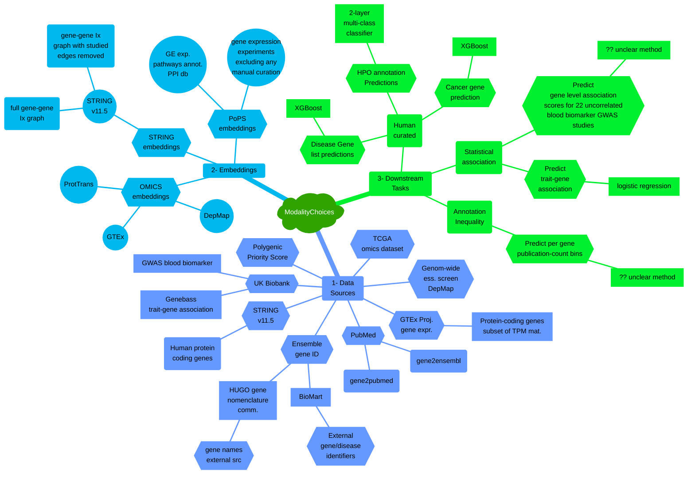
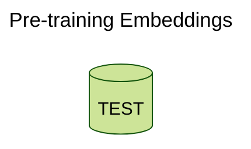

# Paper Review: ModalityChoices

## Table of Contents
1. [Jargon Glossary](#jargon-glossary)
2. [Problem Description](#problem-description)
3. [Problem Relevance](#problem-relevance)
4. [Proposed Solution](#proposed-solution)
5. [Positive Points](#positive-points)
6. [Negative Points](#negative-points)
7. [Questions](#questions)
8. [References](#references)

## Jargon Glossary
[_back to contents_](#table-of-contents)

>**term** - description

## Problem Description
[_back to contents_](#table-of-contents)

TODO

## Problem Relevance
[_back to contents_](#table-of-contents)

TODO

## Proposed Solution
[_back to contents_](#table-of-contents)

TODO

In the above diagram, under **Training Model**, SCN means _Single Channel Network_ and MCN means _Multi-Channel Network_.

### Experimental Data
TODO

### Pre-training Embeddings

## Positive Points
[_back to contents_](#table-of-contents)

TODO

## Negative Points
[_back to contents_](#table-of-contents)

TODO

## Questions
[_back to contents_](#table-of-contents)

TODO

## References
[_back to contents_](#table-of-contents)

[F. Brechtmann, T. Bechtler, S. Londhe, C. Mertes, and J. Gagneur, "Evaluation of input data modality choices on functional gene embeddings," _NAR Genomics and Bioinformatics_, vol. 5, p. lqad095, 11 2023.](https://academic.oup.com/nargab/article/5/4/lqad095/7337624)
